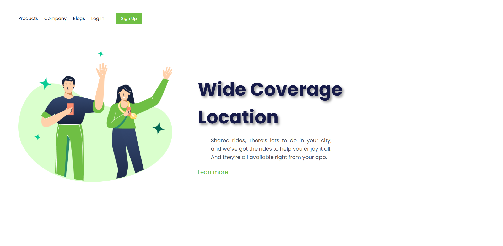

<p align="center">

</p>

# <p align="center" >🌐 Landing Page – Design Practice </p>

---

This project is a **simple landing page** built using **only HTML and CSS**, created for **design and layout practice**.

The website contains **a single page** and does not use JavaScript. The main goal is to improve visual design skills such as layout, spacing, typography, and color usage.

---
## 💻 website view




---
## 🎯 Project Goals

- Practice **semantic HTML**
- Improve **CSS styling**
- Train **landing page design**
- Work on spacing, colors, and typography

---

## 🛠️ Technologies Used

- HTML5
- CSS3

---

## 📁 Project Structure
├── index.html<br>
├── style.css<br>
└── assets/<br>
└── img/<br>


---

## 🚀 How to Run Locally

1. Clone the repository:
   ```bash
   git clone https://github.com/Victor-F-Padua/Location.git
---
🔗 **Live Website:**  
👉 https://victor-f-padua.github.io/Location/

